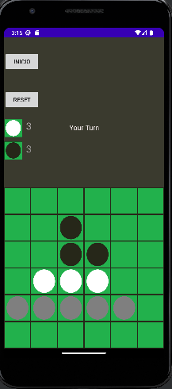

# Reversi 🎮🌀

Reversi is a simplified version of the classic strategy board game, designed for a quick and fun gameplay experience. 

---

## 🛠️ Technologies Used

- **Java**: Native Android development for smooth performance.
- **Custom Game Logic**: Built from scratch for the 6x6 board adaptation.
- **AI**: using Alpha Beta Pruning Algorithm

---

## 🚀 Key Features

- **Simplified Board**: A 6x6 board makes the game faster and more accessible, while maintaining the strategic depth of the original.
- **Single-Player Mode**: Play against a challenging AI opponent.
- **Intuitive Interface**: Clean and straightforward design to focus on gameplay.

---

## 🎲 How to Play

1. Players take turns placing their pieces on the board. 
2. Each move must outflank one or more of the opponent's pieces.
3. Outflanked pieces are flipped to the current player's color.
4. The player with the most pieces of their color at the end of the game wins!

---

## 📸 Screenshot

  

---

## 📝 Notes

This version of Reversi was developed as a personal project to explore game logic implementation and Android UI design. The 6x6 board was chosen to simplify development and offer a unique take on the traditional game.

---
